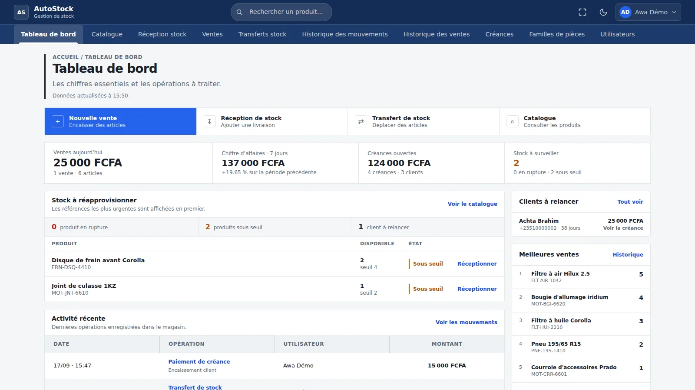
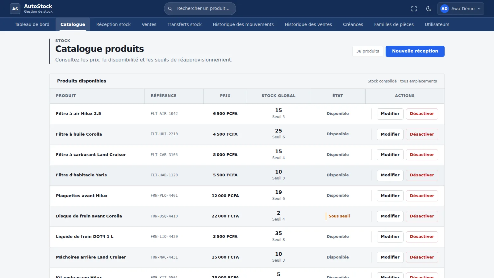
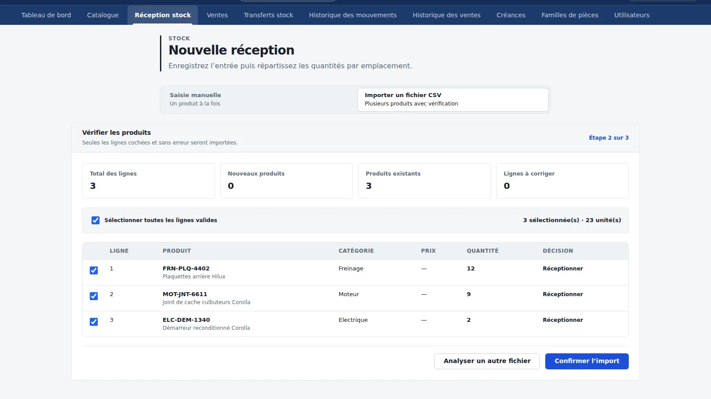
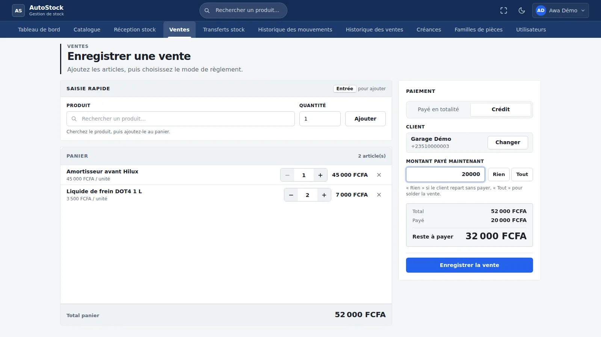
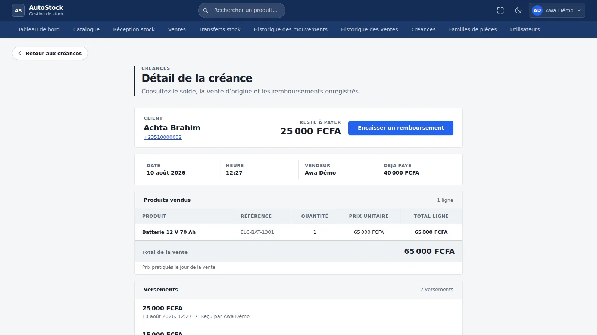
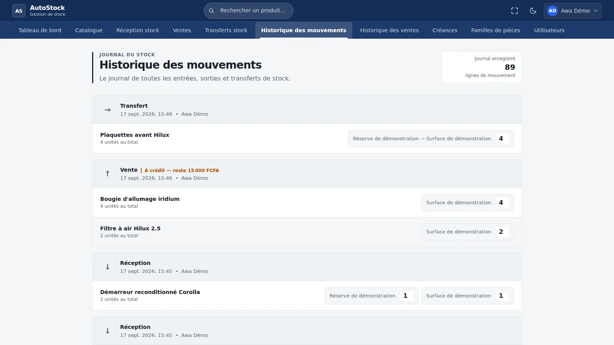

# Auto Stock Management — Frontend

Interface Angular destinée à la gestion d’un magasin de pièces détachées : consulter le catalogue, réceptionner les produits, vendre, suivre les mouvements et les créances. Deux rôles structurent les parcours : vendeur et propriétaire.

**Contexte et statut.** Application développée pour un client du secteur des pièces détachées et précédemment déployée sur un VPS OVHcloud, financé personnellement. Elle n’est plus accessible en ligne ; aucune démo publique ni utilisation active n’est revendiquée.

Le [backend Java/Spring Boot](https://github.com/aliCheikCheikh/auto-stock-management) porte les règles métier et la persistance PostgreSQL. Ce dépôt contient l’interface, les formulaires et les échanges HTTP.

## Parcours implémentés

| Parcours | Ce que permet l’interface |
| --- | --- |
| Se connecter | Connexion, restauration de session, changement de mot de passe temporaire et déconnexion. |
| Consulter le catalogue | Recherche tolérante aux fautes de frappe (servie par l’API), filtres et pagination ; fiche produit, stocks par emplacement ; modification et désactivation selon le rôle. |
| Réceptionner | Saisie des produits et quantités ; import CSV avec modèle téléchargeable, prévisualisation, sélection et bilan par ligne. |
| Vendre | Composition du panier, montant payé, association d’un client pour le crédit et historique des ventes. |
| Suivre le stock | Transfert entre surface et réserve ; historique des mouvements. |
| Gérer les créances | Pour le propriétaire : liste des créances, détail d’une vente, remboursements et créances d’un client. |
| Administrer | Pour le propriétaire : gestion des catégories et des vendeurs, activation/désactivation, réinitialisation du mot de passe. |
| Piloter | Tableau de bord propriétaire : ventes, encaissements, créances, alertes de stock et activité récente. |

Les [routes](src/app/app.routes.ts) donnent les points d’entrée réels. Les restrictions d’interface accompagnent les autorisations du backend ; elles ne constituent pas une barrière de sécurité à elles seules.

## Aperçu réel

Captures du 17 septembre 2026, en mode clair : bundle Angular de production, API Java et PostgreSQL lancés localement, données exclusivement fictives.

| | |
| --- | --- |
|  |  |
| Tableau de bord propriétaire | Catalogue paginé |
|  |  |
| Import CSV vérifié ligne par ligne | Vente à crédit avec acompte |
|  |  |
| Créance et remboursements | Historique des mouvements |

Une vidéo de 3 min 30 enregistrée sur ce même environnement accompagne le portfolio du projet. Le [scénario de présentation](docs/demo-scenario.md) décrit un parcours manuel plus court.

## Stack vérifiée

Versions résolues dans le [package-lock.json](package-lock.json), distinctes des plages du [package.json](package.json) :

| Élément | Version |
| --- | --- |
| Angular | 20.3.21 |
| Angular CLI / build | 20.3.26 |
| TypeScript | 5.9.3 |
| RxJS | 7.8.2 |
| Jasmine / Karma | 5.9.0 / 6.4.4 |

L’interface utilise les composants standalone, les formulaires réactifs, les signals Angular et SCSS. La CI et le Dockerfile utilisent Node.js 22 ; pour cette branche, prévoir **Node.js 22.12 ou supérieur dans la série 22**, conformément aux contraintes des dépendances verrouillées.

## Organisation et choix techniques

```text
src/app/
├── core/       authentification, session, chargement, notifications, thème, contrats API
├── features/   domaines fonctionnels : products, sales, debts, dashboard, users…
│   └── …/      pages, data-access, models et composants UI selon le besoin
└── shared/     composants réutilisables, formatage et utilitaires
```

Les pages pilotent les interactions et appellent des services `data-access` via `HttpClient`. Les types des modèles décrivent les requêtes/réponses. Les composants partagés fournissent notamment pagination, dialogues, chargement et badges de règlement. Cette organisation par fonctionnalité ne constitue pas, à elle seule, une architecture hexagonale côté frontend.

Quelques exemples à explorer :

- [AuthService](src/app/core/auth/auth.service.ts) conserve l’utilisateur dans un signal exposé en lecture seule ; les cookies de session sont gérés par le navigateur. Les [intercepteurs](src/app/core/auth) ajoutent les credentials, tentent un renouvellement après un 401 et traitent les accès interdits. Le mot de passe actuel incorrect lors d’un changement est distingué d’une expiration de session.
- [SalesApiService](src/app/features/sales/data-access/sales-api.service.ts) regroupe les appels de vente et peut envoyer `Idempotency-Key`. Le serveur reste responsable des prix, de la disponibilité et de l’enregistrement métier.
- [NewStockReceiptPage](src/app/features/stock-receipts/pages/new-stock-receipt-page/new-stock-receipt-page.ts) orchestre la réception et l’import ; une garde de sortie protège le parcours d’import en cours.
- [DashboardPage](src/app/features/dashboard/pages/dashboard-page/dashboard-page.ts) combine signals et RxJS pour les états de chargement, l’actualisation manuelle et périodique, avec prise en compte de la visibilité de la page. `exhaustMap` évite de superposer ses chargements.
- [MoneyPipe](src/app/shared/pipes/money.pipe.ts) formate les montants transmis sous forme de chaînes, sans conversion en `Number` pour l’affichage ; XAF est affiché en FCFA.

Le tableau de bord est chargé à la demande par le routeur ; les autres pages ne sont pas toutes chargées de cette façon.

## Lancer le frontend

Prérequis : Node.js 22.12+ dans la série 22, npm et le backend disponible sur `localhost:8080` pour les parcours authentifiés. Chrome/Chromium est nécessaire pour les tests Karma, pas pour compiler l’application.

Depuis la racine du frontend :

```bash
npm ci
npm start
```

Ouvrir [http://localhost:4200](http://localhost:4200). Le [proxy de développement](proxy.config.json), déjà référencé dans [angular.json](angular.json), relaie `/api` vers `http://localhost:8080`. Les services utilisent des URL relatives `/api/v1` : aucun secret ni jeton ne doit être ajouté dans le bundle frontend.

Pour utiliser une API locale sur un autre port, adapter uniquement la cible du proxy, par exemple `http://localhost:8081`. En cas de changement de machine ou d’origine, vérifier également la politique des cookies et la configuration serveur.

### Compte et données fictives

Suivre d’abord la section « Lancer une démonstration locale » du [README backend](https://github.com/aliCheikCheikh/auto-stock-management#lancer-une-démonstration-locale). Elle décrit une base isolée, le propriétaire fictif `owner@example.test`, les deux emplacements et un CSV de produits de démonstration.

Une fois connecté, importer ce CSV depuis la réception de stock, prévisualiser et valider les lignes. Le catalogue permet ensuite de préparer une vente et de vérifier son historique et ses mouvements. Les identifiants de connexion sont ceux définis au démarrage du backend ; ils ne se configurent pas dans Angular.

Sans API, l’écran de connexion s’affiche mais l’authentification et les parcours métier ne fonctionnent pas. Aucun mode de démonstration autonome avec API simulée n’est fourni.

## Tests et build

```bash
# Build de production
npm run build

# Tests interactifs
npm test

# Commande de la CI
npm test -- --watch=false --browsers=ChromeHeadless

# Serveur avec rechargement automatique
npm start
```

Le build génère `dist/auto-stock-management-front/browser`. Les [budgets Angular](angular.json) contrôlent la taille initiale et les styles des composants. Le [workflow CI](.github/workflows/ci.yml) exécute `npm ci`, le build et les tests sur les pull requests.

Les fichiers `*.spec.ts` testent notamment les pages, formulaires, gardes, intercepteurs et services avec TestBed et doublures HTTP. Voir les [tests de renouvellement de session](src/app/core/auth/refresh.interceptor.spec.ts) et les [tests de réception](src/app/features/stock-receipts/pages/new-stock-receipt-page/new-stock-receipt-page.spec.ts). Aucun runner de tests navigateur de bout en bout n’est configuré ; `ng e2e` n’est donc pas une commande opérationnelle documentée ici. La présence de tests ne prouve pas une démarche TDD.

**Parcours navigateur du 17 septembre 2026 :** le build de production de ce dépôt, servi derrière un proxy `/api` vers l’API locale, a été piloté avec Playwright (Chromium) en mode clair : connexion et changement du mot de passe temporaire, recherche globale, pagination, réception manuelle, import CSV (aperçu puis confirmation), vente à crédit avec sélection du client, transfert, historiques, remboursement partiel, création d’un vendeur et d’une famille de pièces. Ce script a servi à produire la vidéo ; il n’est pas intégré au dépôt comme suite de tests. `npm ci` et Karma n’ont pas pu être relancés dans cet environnement (registre npm inaccessible).

**Vérification locale du 16 septembre 2026 :** build de production réussi avec Node.js 22.16.0 et npm 10.9.2, serveur démarré et connexion vérifiée visuellement. Les commandes ont utilisé les dépendances déjà installées ; `npm ci` n’a pas été rejoué. Pour stabiliser l’exécution dans l’environnement de vérification, le build a été lancé avec `CI=true NG_BUILD_MAX_WORKERS=2`. La compilation des tests a réussi, mais Karma n’a pas exécuté la suite : aucun binaire Chrome n’était disponible. Sur une machine équipée, `CHROME_BIN` permet d’indiquer son chemin.

## Conteneurisation et déploiement passé

Le [Dockerfile](Dockerfile) construit Angular avec Node 22 puis sert le bundle avec Nginx. La [configuration Nginx](nginx.conf) gère le repli vers `index.html` pour les routes SPA et relaie `/api/` vers `backend:8080`.

```bash
docker build -t auto-stock-frontend:local .
```

Cette commande n’a pas été exécutée pendant la préparation, faute de moteur Docker actif. Le conteneur doit rejoindre un réseau où le nom `backend` est résolu ; il ne fournit pas à lui seul une stack complète ni la terminaison HTTPS. Les fichiers décrivent un mode de livraison, pas un service actuellement en ligne.

## Limites et suites possibles

- Le fonctionnement métier dépend du backend et d’un contexte magasin initialisé ; les gardes ne remplacent pas les contrôles serveur.
- Le parcours courant est mono-magasin et utilise principalement XAF. Les libellés supplémentaires du formateur ne constituent pas une gestion multidevise complète.
- Le parcours réception CSV → vente à crédit → remboursement partiel → contrôle du stock a été vérifié manuellement dans le navigateur le 17 septembre 2026. Son automatisation reste à réaliser.
- Les prochaines améliorations possibles sont la validation des parcours sur différentes tailles d’écran et avec navigation clavier, ainsi que la coordination des renouvellements de session simultanés. Elles ne sont pas présentées comme déjà validées.
